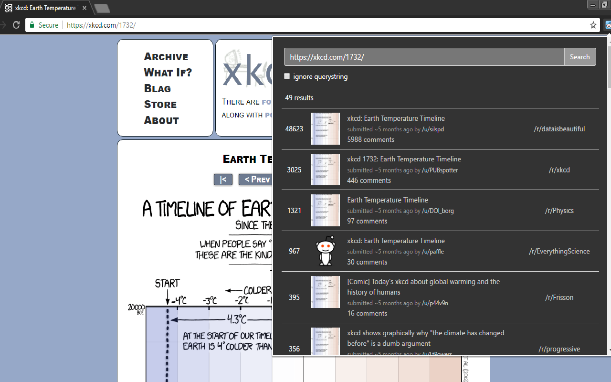

# Find on Reddit
Chrome extension that searches for submissions of the current URL on Reddit. 

## Download
  - Google Webstore: https://chrome.google.com/webstore/detail/find-on-reddit/jbcdpeekakanklckgooknpbonojhjncm  
  - CRX file: https://github.com/AdeelH/find-on-reddit/releases/latest

## Features
  - search for the URL of the current tab (automatically or when clicked)
  - option to ignore URL's query-string
  - special handling of Youtube video links: search by video ID to match all variations of Youtube links

## Screenshot

