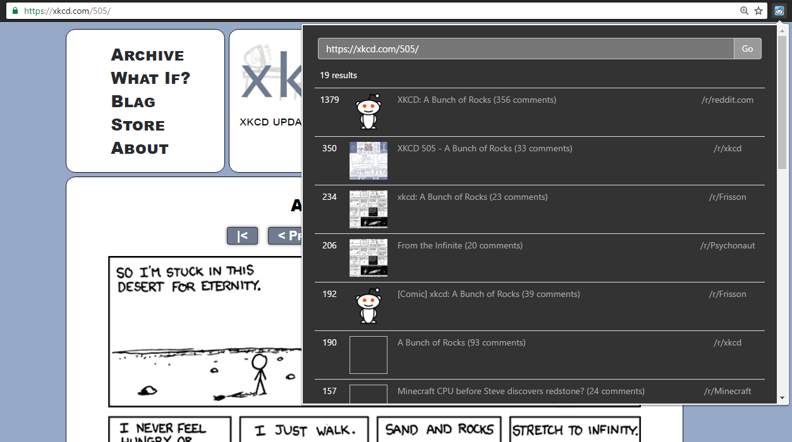

# find-on-reddit
Chrome extension that searches for submission of the current URL on Reddit

## Features
  - searches for the URL of the current tab
  - the URL to search for can be edited in the input field
  - option to ignore URL querystring
  - special handling of Youtube video links: searches using the video ID to match all variations of Youtube links (toggleable)

## Screenshot

